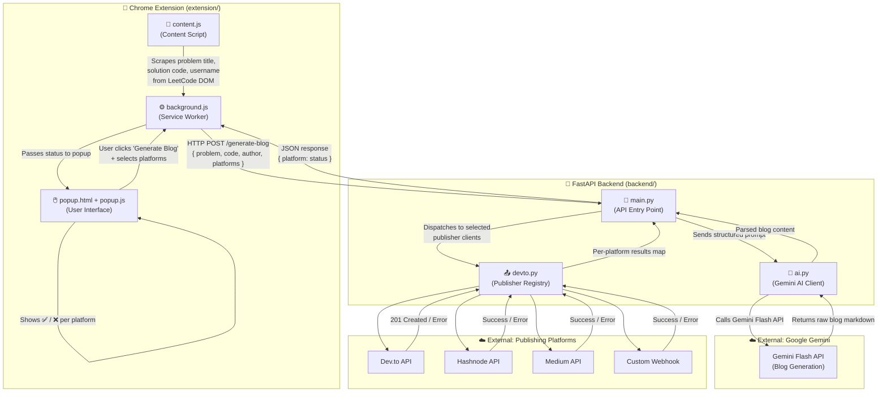
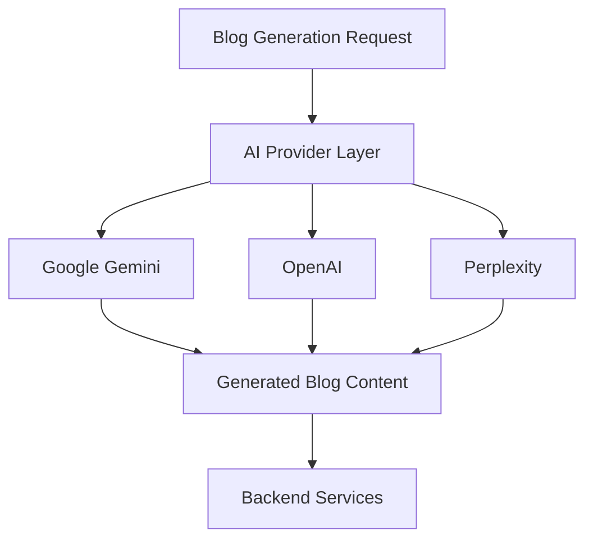
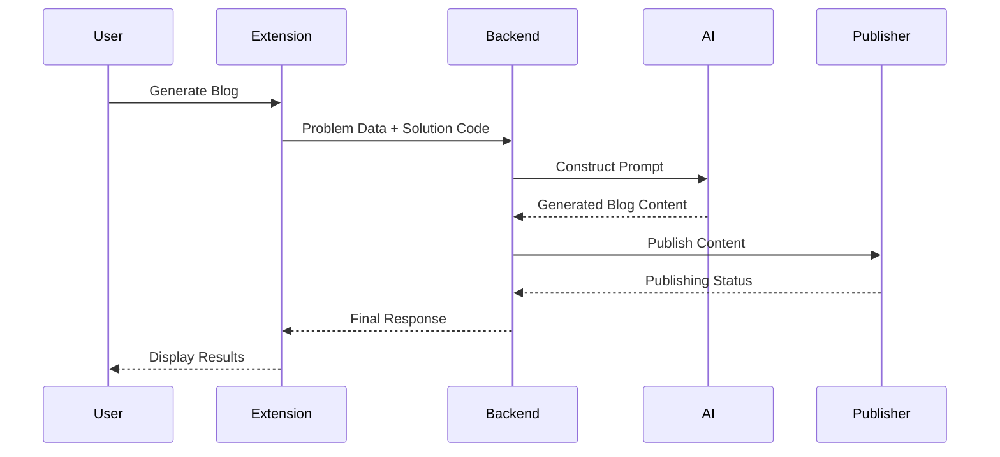
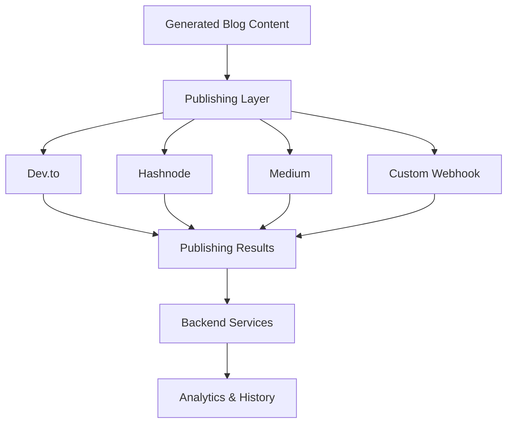
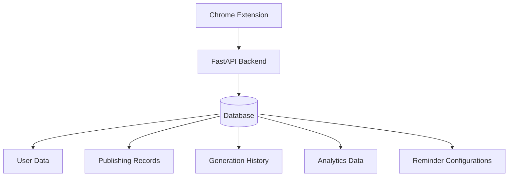
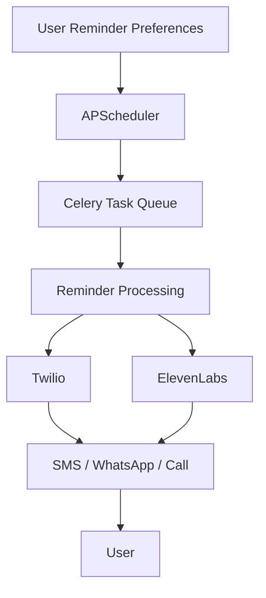
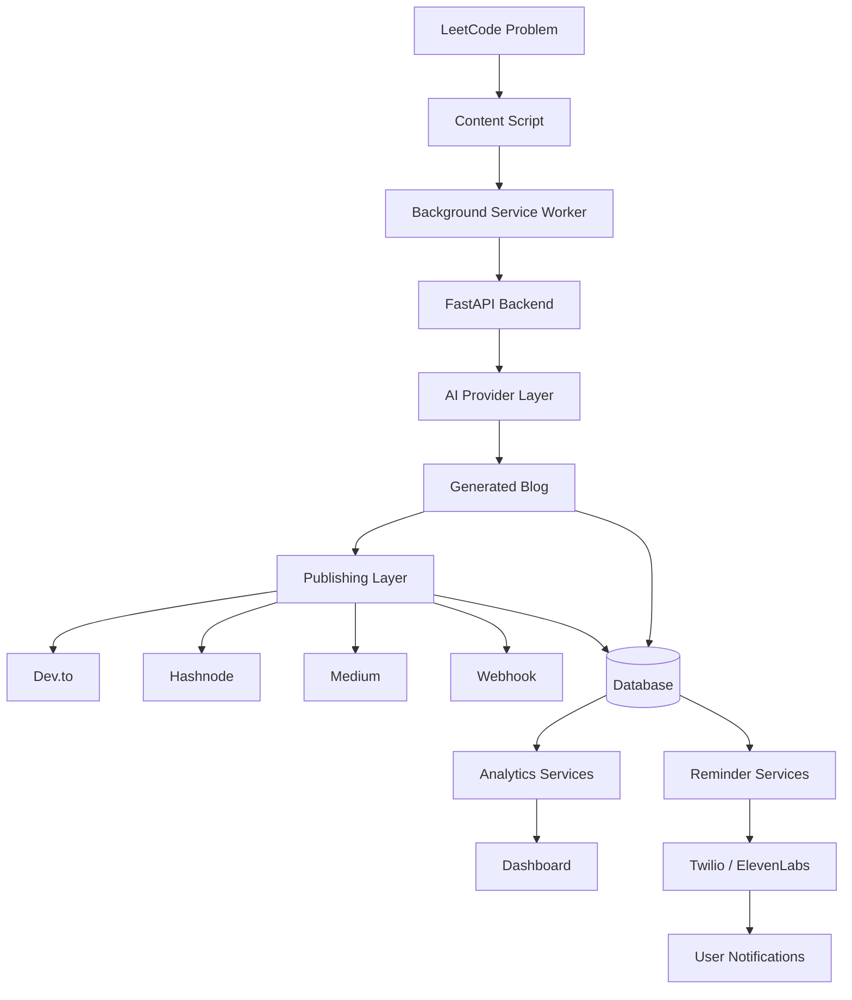
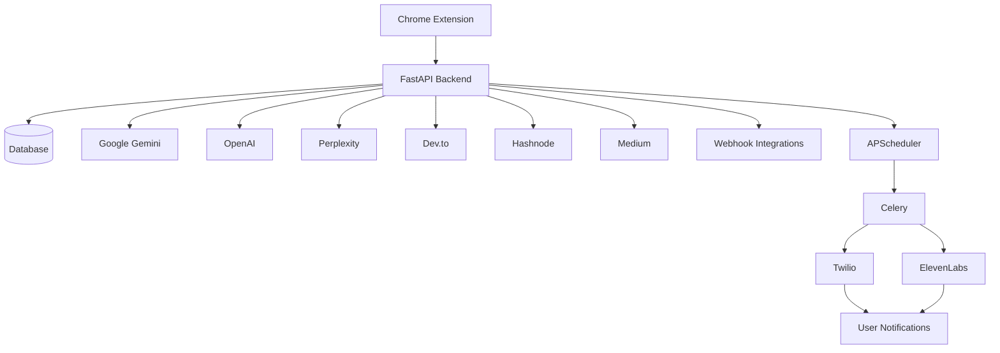

# 🏗️ LeetLog AI — Architecture

This document explains how LeetLog AI's components fit together. It is written for new contributors who want to understand the system before making changes. This document is intended to provide a high-level architectural overview of the system and contributor onboarding guidance. Some sections describe the current implementation while others document architectural direction and extensibility considerations.

---
# Introduction

LeetLog AI is an AI-powered productivity and content automation platform designed to help developers transform their LeetCode problem-solving journey into high-quality technical content. The project bridges the gap between coding practice and technical content creation by automatically converting solved LeetCode problems into structured, publish-ready blog posts.

The system combines a Chrome Extension, a FastAPI-based backend, multiple AI providers, publishing platform integrations, analytics services, and reminder infrastructure into a unified workflow. By automating repetitive tasks such as extracting problem information, generating explanations, formatting content, and publishing blogs, LeetLog AI allows developers to focus on learning and problem-solving rather than manual content creation.

At a high level, the platform operates by collecting problem details and user solutions from LeetCode through a browser extension. The extracted information is securely transmitted to the backend, where AI-powered content generation services produce detailed technical blogs. The generated content can then be reviewed, edited, and published across multiple supported platforms such as Hashnode, Dev.to, Medium, and other integrated publishing services.

Beyond content generation, the system also provides productivity-focused features such as progress tracking, publishing analytics, reminder automation, and platform integrations. These capabilities enable users to maintain consistency in their learning journey while building a public technical portfolio.

The primary objective of this architecture document is to provide contributors and developers with a comprehensive understanding of how the system is organized, how different modules interact, how data flows throughout the platform, and the architectural decisions that support scalability, maintainability, and future extensibility.

This document serves as a single source of truth for understanding the internal architecture of LeetLog AI and is intended to reduce onboarding time for new contributors while improving overall maintainability of the codebase.

# Architectural Principles

The architecture of LeetLog AI is designed around a set of core engineering principles that promote maintainability, scalability, extensibility, and developer productivity. These principles guide how individual components are structured, how services communicate with each other, and how future features can be integrated into the platform.

## Separation of Concerns

One of the primary architectural goals of the system is the separation of concerns. Each major component of the platform is responsible for a specific set of tasks and operates independently from other components whenever possible.

For example:

* The Chrome Extension is responsible for extracting problem information and interacting with the user.
* The FastAPI Backend is responsible for business logic, data processing, and orchestration.
* AI Providers are responsible for generating content.
* Publishing Services are responsible for distributing content to external platforms.
* Analytics and Reminder Systems handle productivity-related features.

By separating responsibilities across different modules, the system becomes easier to maintain, debug, and extend over time.

---

## Modularity

The platform follows a modular architecture where each feature is implemented as a self-contained component.

Examples include:

* AI Provider Modules
* Publishing Modules
* Reminder Services
* Dashboard Components
* Authentication Components

This modular design allows contributors to work on individual features without affecting unrelated parts of the system. It also enables the development team to introduce new functionality with minimal modifications to the existing codebase.

---

## Extensibility

The architecture is designed with future growth in mind.

The system supports extensibility through abstraction layers and well-defined interfaces. New capabilities can be added without requiring major architectural changes.

Examples include:

* Adding a new AI provider such as Claude or Grok.
* Integrating additional publishing platforms.
* Supporting new reminder channels.
* Introducing advanced analytics modules.
* Expanding browser extension functionality.

This approach ensures that the platform can evolve as requirements change while minimizing technical debt.

---

## Provider Abstraction

AI-powered functionality is implemented through a provider abstraction layer rather than directly coupling the application to a single AI service.

Instead of embedding provider-specific logic throughout the codebase, the system interacts with AI providers through a common interface.

This design offers several advantages:

* Reduced vendor lock-in.
* Easier maintenance.
* Improved reliability through fallback mechanisms.
* Simplified integration of future providers.

As a result, content generation workflows remain consistent regardless of which AI provider is used behind the scenes.

---

## Publishing Abstraction

Publishing functionality follows a similar abstraction strategy.

Rather than implementing separate workflows for every publishing platform, the system uses reusable publishing interfaces that standardize how content is created, validated, formatted, and submitted.

This architecture simplifies support for multiple platforms while ensuring consistent behavior across publishing targets.

Benefits include:

* Reduced code duplication.
* Easier platform integration.
* Simplified testing.
* Better maintainability.

---

## Scalability

The system is designed to accommodate increasing numbers of users, content generation requests, and publishing operations.

Several architectural choices support scalability:

* Independent service layers.
* Asynchronous task processing.
* Background job execution.
* Externalized database infrastructure.
* Distributed API integrations.

By minimizing tight coupling between components, the platform can scale individual services independently as demand grows.

---

## Maintainability

Long-term maintainability is a key consideration throughout the project.

The codebase is organized into logical modules, follows consistent naming conventions, and separates business logic from infrastructure concerns.

This approach provides several benefits:

* Faster debugging.
* Easier onboarding of contributors.
* Reduced implementation complexity.
* Improved documentation quality.
* Simplified feature enhancements.

Maintaining a clean and well-structured architecture helps ensure that contributors can understand and modify the system efficiently.

---

## Contributor-Friendly Design

As an open-source project, LeetLog AI prioritizes contributor accessibility.

The architecture is intentionally structured to make it easier for new developers to understand the system and contribute effectively.

Documentation, modular organization, clear workflows, and separation of responsibilities collectively reduce the learning curve for contributors and encourage community-driven development.

This principle plays a significant role in ensuring the long-term sustainability and growth of the project.


## System Flow Diagram



---
# High-Level System Overview

LeetLog AI follows a distributed, multi-layered architecture that combines browser automation, backend services, artificial intelligence, publishing integrations, analytics, and productivity features into a single platform. The system is designed to automate the process of transforming solved LeetCode problems into structured technical blog posts while minimizing manual effort from the user.

At a high level, the workflow begins inside the user's browser through the Chrome Extension. When a user visits a LeetCode problem page and decides to generate a blog, the extension collects relevant information such as the problem title, problem description, difficulty level, and the user's solution code. This information serves as the primary input for the content generation pipeline.

Once the required data has been collected, the extension communicates with the FastAPI backend through secure API requests. The backend acts as the central orchestration layer of the system and is responsible for coordinating all major operations including content generation, publishing, analytics processing, user management, and reminder scheduling.

After receiving the request, the backend forwards the problem information to the AI generation layer. The AI provider processes the supplied context and generates a detailed blog article that explains the problem statement, solution approach, algorithmic reasoning, complexity analysis, and implementation details. The generated content is then formatted into a publish-ready structure suitable for technical blogging platforms.

The publishing layer receives the generated blog and distributes it to the platforms selected by the user. Depending on configuration and user preferences, the same content can be published across multiple destinations such as Dev.to, Hashnode, Medium, or custom webhook endpoints. Each publishing integration operates independently, ensuring that failures in one platform do not interrupt successful publishing on other platforms.

To support long-term user engagement, the system also includes analytics and reminder subsystems. Analytics services track publishing activity, content generation history, and user engagement metrics, while reminder services help users maintain consistency in solving problems and publishing content. These features are implemented using scheduled jobs, background task processing, and third-party communication services.

From an architectural perspective, the platform is intentionally organized into loosely coupled components. The Chrome Extension handles user interaction and data collection, the backend manages business logic, AI providers focus on content generation, publishing services handle content distribution, and auxiliary systems manage analytics and reminders. This separation of responsibilities improves maintainability, simplifies testing, and allows individual modules to evolve independently without affecting the entire system.

The resulting architecture enables LeetLog AI to function as a scalable content automation platform capable of supporting future enhancements such as additional AI providers, new publishing destinations, advanced analytics capabilities, collaboration features, and expanded productivity tools.


## Layer-by-Layer Explanation

# Chrome Extension Architecture

The Chrome Extension serves as the primary user-facing component of LeetLog AI and acts as the entry point for the entire content generation workflow. It is responsible for interacting with the LeetCode website, collecting problem-related information, communicating with the backend services, and presenting results to the user.

Unlike traditional web applications, the extension operates directly inside the user's browser environment. This allows the system to access contextual information from the active LeetCode tab without requiring manual copying and pasting of problem statements or solution code.

The extension architecture is divided into four major components:

* Content Script
* Background Service Worker
* Popup Interface
* Dashboard Interface

Each component has a specific responsibility and communicates with other components through Chrome's messaging APIs.

---

## Content Script

The Content Script is injected directly into supported LeetCode pages and serves as the data acquisition layer of the extension.

Its primary responsibility is to access and analyze the Document Object Model (DOM) of the active LeetCode page. By interacting with page elements, the script extracts information that is required for blog generation.

Typical information collected includes:

* Problem title
* Problem description
* Difficulty level
* User solution code
* Programming language
* Username and metadata

Once the required information has been collected, the content script packages the extracted data into a structured format and forwards it to the Background Service Worker through Chrome's internal messaging system.

The Content Script does not communicate directly with external APIs. This design improves security and ensures that sensitive operations remain isolated within the backend infrastructure.

### Responsibilities

* Detect supported LeetCode pages
* Extract problem-related information
* Extract user solution code
* Capture contextual metadata
* Forward structured data to the background worker

---

## Background Service Worker

The Background Service Worker acts as the central communication hub of the extension.

All requests originating from the popup interface or content script eventually pass through the background worker before reaching the backend services.

This component is responsible for:

* Managing extension state
* Processing internal messages
* Performing backend API requests
* Handling asynchronous operations
* Returning results to the user interface

When a user initiates blog generation, the popup sends a request to the background worker. The worker then coordinates with the content script to collect problem information and subsequently sends the complete payload to the FastAPI backend.

The background worker also handles response processing and ensures that publishing results are delivered back to the appropriate user interface components.

### Responsibilities

* Coordinate communication between extension components
* Handle API requests to backend services
* Manage asynchronous workflows
* Process backend responses
* Maintain extension-wide state

---

## Popup Interface

The Popup Interface provides the primary interaction point between the user and the extension.

It appears when the user clicks the extension icon and offers controls for configuring content generation and publishing behavior.

The popup is intentionally lightweight and focuses on workflow execution rather than long-term data visualization.

Through this interface, users can:

* Select publishing platforms
* Configure preferences
* Trigger blog generation
* Review publishing status
* Manage integration settings

The popup communicates with the background worker rather than directly interacting with backend services. This separation simplifies state management and keeps the user interface independent from networking logic.

### Responsibilities

* Collect user preferences
* Trigger generation requests
* Display generation status
* Display publishing results
* Provide access to configuration options

---

## Dashboard Interface

The Dashboard serves as the analytics and monitoring component of the extension ecosystem.

While the popup focuses on executing actions, the dashboard focuses on presenting information.

The dashboard retrieves data from backend analytics services and presents metrics related to user activity and publishing performance.

Examples of information displayed include:

* Generated blog count
* Publishing statistics
* Activity history
* Productivity metrics
* Platform-specific performance information

By separating analytics from the popup workflow, the architecture maintains a clear distinction between operational tasks and reporting functionality.

### Responsibilities

* Display historical activity
* Present publishing analytics
* Show productivity insights
* Visualize usage metrics
* Retrieve dashboard data from backend services

---

## Internal Communication Flow

The extension follows a message-driven architecture.

Instead of allowing every component to communicate directly with external services, requests flow through a controlled communication path.

The workflow can be summarized as:

1. User initiates an action from the popup interface.
2. The popup sends a message to the background worker.
3. The background worker requests data from the content script.
4. The content script extracts information from the active LeetCode page.
5. Extracted data is returned to the background worker.
6. The background worker sends the request to the backend API.
7. Backend responses are processed by the background worker.
8. Results are returned to the popup or dashboard interface.

This architecture improves maintainability, simplifies debugging, and provides a clear separation between user interface components, browser automation logic, and backend communication.


---

### 2. FastAPI Backend (`backend/`)

The FastAPI backend serves as the central orchestration layer of the LeetLog AI platform. While the Chrome Extension is responsible for collecting user inputs and interacting with the browser environment, the backend is responsible for executing all core business logic, coordinating external integrations, managing data persistence, handling AI interactions, processing publishing requests, and supporting analytics and reminder workflows.

The backend acts as the single source of truth for the entire platform. All extension requests, publishing operations, AI generation tasks, analytics retrieval, authentication workflows, and reminder services are routed through backend services before being processed and returned to the user.

The architecture follows a layered design approach that separates responsibilities into distinct logical components. This separation improves maintainability, simplifies testing, and enables future scalability.

---

## Backend Responsibilities

The backend is responsible for several critical functions within the system:

* Processing requests received from the Chrome Extension
* Managing user authentication and account information
* Generating blog content using AI providers
* Coordinating publishing workflows
* Storing analytics and historical records
* Managing reminder scheduling and delivery
* Integrating with external APIs and third-party services
* Providing data to dashboard and reporting interfaces

By centralizing these responsibilities, the backend ensures consistency across all platform features.

---

## API Layer

The API Layer acts as the external interface of the backend.

It exposes REST endpoints that can be consumed by the Chrome Extension, dashboard interfaces, and future client applications.

The API layer is responsible for:

* Request validation
* Input sanitization
* Authentication verification
* Response formatting
* Error handling

Rather than allowing frontend components to directly access internal services, all communication is routed through standardized API endpoints.

This design provides a controlled and secure access mechanism for backend functionality.

### Major API Categories

The backend exposes functionality through several categories of endpoints:

#### Authentication APIs

Authentication endpoints manage user identity and account access.

Typical responsibilities include:

* User registration
* User login
* Session validation
* User profile retrieval

These endpoints ensure that platform functionality is accessible only to authorized users.

---

#### Blog Generation APIs

Blog generation endpoints are responsible for initiating the content creation workflow.

Requests typically contain:

* Problem title
* Problem description
* Difficulty level
* User solution code
* Selected publishing platforms

The backend processes this information and forwards it to the AI generation subsystem.

---

#### Publishing APIs

Publishing endpoints manage the distribution of generated content across supported blogging platforms.

Responsibilities include:

* Platform selection
* Credential validation
* Publishing execution
* Publishing status reporting

These APIs abstract platform-specific implementation details and provide a consistent publishing interface.

---

#### Dashboard APIs

Dashboard endpoints provide analytics and reporting data to frontend interfaces.

Examples include:

* Publishing statistics
* Generated blog counts
* Historical activity
* User engagement metrics

These endpoints support monitoring and productivity tracking features.

---

#### Reminder APIs

Reminder endpoints manage user reminder preferences and notification scheduling.

Responsibilities include:

* Reminder registration
* Reminder updates
* Reminder cancellation
* Delivery configuration

These APIs provide the foundation for long-term user engagement features.

---

## Service Layer

The Service Layer contains the core business logic of the platform.

While API endpoints handle communication and validation, service modules are responsible for executing actual operations.

Examples include:

* Blog generation services
* Publishing services
* Analytics services
* Reminder services
* User management services

Separating business logic from API endpoints prevents duplication and improves code organization.

A typical workflow follows this pattern:

Request → API Layer → Service Layer → Database / External Service → Response

This structure ensures that business logic remains reusable and independent from transport mechanisms.

---

## Integration Layer

The Integration Layer manages communication with external systems and third-party providers.

Examples include:

* Google Gemini
* OpenAI
* Perplexity
* Dev.to
* Hashnode
* Medium
* Twilio
* ElevenLabs

Rather than allowing business logic modules to directly interact with third-party APIs, integrations are encapsulated within dedicated service modules.

This approach offers several advantages:

* Simplified maintenance
* Improved testability
* Reduced coupling
* Easier provider replacement
* Consistent error handling

The integration layer acts as a protective boundary between internal services and external systems.

---

## Data Persistence Layer

The Data Persistence Layer is responsible for storing and retrieving application data.

This layer manages:

* User accounts
* Publishing history
* Analytics records
* Reminder preferences
* Configuration settings

The persistence layer isolates database-specific implementation details from business logic components.

As a result, service modules can interact with application data without requiring knowledge of storage-specific operations.

This design improves maintainability and simplifies future migration efforts if database technologies change.

---

## Request Processing Lifecycle

Every request entering the backend follows a predictable processing path.

1. The API layer receives an incoming request.
2. Request data is validated and sanitized.
3. Authentication checks are performed when required.
4. The request is forwarded to the appropriate service layer component.
5. Business logic is executed.
6. External integrations are invoked when necessary.
7. Results are stored or updated in the persistence layer.
8. A structured response is returned to the API layer.
9. The API layer returns a standardized response to the client.

This workflow ensures consistency across all backend operations and simplifies debugging and monitoring efforts.

---

## Architectural Benefits

The backend architecture provides several important benefits:

* Clear separation between communication and business logic.
* Improved scalability through modular service design.
* Simplified integration with external platforms.
* Better maintainability and code organization.
* Easier onboarding for contributors.
* Consistent handling of requests and responses.
* Greater flexibility for future feature expansion.

By organizing responsibilities into dedicated layers, the backend remains adaptable, maintainable, and capable of supporting future growth of the platform.
# AI Provider Architecture

The AI Provider Layer is one of the core components of the LeetLog AI platform and is responsible for transforming raw LeetCode problem information into structured, publish-ready technical blog content. This layer acts as an abstraction between the backend services and the underlying Large Language Models (LLMs) used for content generation.

Rather than embedding AI-specific logic throughout the application, the architecture isolates all AI-related functionality within a dedicated provider layer. This approach improves maintainability, simplifies future enhancements, and allows the system to support multiple AI providers through a consistent interface.

The primary responsibility of this layer is to receive problem information, construct generation prompts, communicate with the selected AI provider, process the generated response, and return formatted content back to the backend services.

---

## Purpose of the AI Provider Layer

The AI Provider Layer exists to separate content generation logic from the rest of the application.

Without this abstraction, backend services would need to directly interact with individual AI providers, resulting in tightly coupled code and increased maintenance complexity.

By introducing a dedicated provider layer, the system gains several advantages:

* Cleaner architecture
* Improved maintainability
* Reduced provider dependency
* Easier future integrations
* Consistent content generation workflows

This design ensures that changes to AI providers do not require modifications throughout the entire codebase.

---

## Supported AI Providers

The architecture is designed to support multiple AI providers for content generation.

Currently supported and planned providers include:

### Google Gemini

Google Gemini serves as the primary content generation engine and is responsible for producing structured blog content from LeetCode problem data.

Typical responsibilities include:

* Problem explanation generation
* Solution walkthrough creation
* Complexity analysis generation
* Technical content structuring
* Blog formatting assistance

---

### OpenAI

The architecture is designed to accommodate OpenAI-based models as additional content generation providers.

Supporting OpenAI enables:

* Provider flexibility
* Improved reliability
* Alternative generation strategies
* Future feature expansion

---

### Perplexity

Perplexity support extends the architecture's ability to integrate additional AI services through the same abstraction layer.

This approach allows the system to remain provider-agnostic while maintaining a consistent content generation workflow.

---

## Provider Abstraction Model

The AI layer follows an abstraction-based architecture.

Instead of allowing backend services to communicate directly with individual providers, requests are routed through a common AI provider interface.

This architecture can be represented as:

```text
Blog Generation Request
            ↓
    AI Provider Layer
            ↓
  Selected AI Provider
            ↓
     Generated Content
```

The backend does not need to understand provider-specific APIs, authentication mechanisms, request formats, or response structures.

All provider-specific implementation details remain isolated within the AI layer.

---

## AI Content Generation Workflow

The content generation process follows a structured sequence of operations.

### Step 1: Request Reception

The backend receives problem information from the Chrome Extension.

Typical inputs include:

* Problem title
* Problem description
* Difficulty level
* Solution code
* Programming language
* User metadata

---

### Step 2: Prompt Construction

The AI provider layer converts the incoming information into a carefully structured prompt.

The prompt is designed to guide the language model in generating:

* Problem overview
* Solution explanation
* Algorithm breakdown
* Complexity analysis
* Implementation discussion
* Conclusion

Prompt construction plays a critical role in maintaining consistency and quality across generated content.

---

### Step 3: AI Processing

The structured prompt is submitted to the selected AI provider.

The language model processes the provided context and generates a comprehensive technical article based on the supplied information.

---

### Step 4: Response Processing

After content generation is complete, the response is validated and processed.

This stage may include:

* Content cleaning
* Formatting adjustments
* Markdown preparation
* Structure validation

The goal is to ensure that generated content is suitable for direct publishing.

---

### Step 5: Content Delivery

The finalized blog content is returned to the backend service layer.

The backend can then:

* Display the generated content to the user
* Send the content to publishing services
* Store generation history
* Update analytics records

---

## Architectural Benefits

The AI Provider Layer provides several important architectural advantages.

### Provider Independence

The platform is not tightly coupled to any single AI vendor.

This reduces dependency on provider-specific implementations and improves long-term flexibility.

---

### Extensibility

New AI providers can be integrated with minimal modifications to the rest of the system.

Examples include:

* Claude
* Grok
* Mistral
* Llama-based models

---

### Maintainability

AI-related code remains isolated from business logic, making the application easier to maintain and debug.

---

### Consistency

All content generation requests follow a standardized workflow regardless of the selected provider.

This ensures predictable behavior across different AI services.

---

## High-Level AI Provider Architecture



The AI Provider Layer serves as the central bridge between backend business logic and external language models, ensuring that content generation remains scalable, maintainable, and adaptable as new AI technologies become available.


# Blog Generation Pipeline

The Blog Generation Pipeline is the core workflow of LeetLog AI and represents the primary value delivered by the platform. It is responsible for transforming a solved LeetCode problem into a structured, publish-ready technical blog article through a sequence of coordinated operations involving the Chrome Extension, backend services, AI providers, and publishing infrastructure.

The pipeline is designed to automate repetitive content creation tasks while maintaining consistency, readability, and technical accuracy across generated blog posts.

At a high level, the process begins when a user solves a LeetCode problem and initiates the blog generation workflow through the Chrome Extension. The collected problem information is then processed by backend services and transformed into technical content through AI-powered generation mechanisms.

---

## Pipeline Objectives

The blog generation pipeline is designed to achieve several goals:

* Automate technical content creation
* Reduce manual documentation effort
* Improve consistency across generated blogs
* Create publication-ready content
* Support multi-platform publishing workflows
* Enable rapid content generation from coding activities

By automating these tasks, developers can focus on problem-solving while simultaneously building their technical portfolio.

---

## Stage 1: Problem Data Collection

The workflow begins inside the Chrome Extension.

When a user opens a LeetCode problem page and requests blog generation, the extension collects contextual information from the active tab.

The collected information typically includes:

* Problem title
* Problem description
* Difficulty level
* User solution code
* Programming language
* User metadata

This information forms the foundation of the content generation process.

The extracted data is validated and structured before being forwarded to backend services.

---

## Stage 2: Request Preparation

After data collection is complete, the Background Service Worker prepares a generation request.

This request contains:

* Problem information
* User solution
* Publishing preferences
* Additional configuration options

The request is then transmitted to the FastAPI backend through secure API communication.

At this stage, the backend becomes responsible for orchestrating the remainder of the workflow.

---

## Stage 3: Prompt Construction

Once the backend receives the request, the AI Provider Layer constructs a structured prompt.

The prompt is one of the most critical components of the generation process because it determines the quality, structure, and consistency of the resulting content.

The generated prompt typically guides the language model to produce:

* Problem overview
* Solution explanation
* Algorithm discussion
* Complexity analysis
* Code walkthrough
* Key takeaways
* Conclusion

Prompt engineering ensures that generated blogs follow a predictable format suitable for technical audiences.

---

## Stage 4: AI Content Generation

After prompt construction, the request is forwarded to the selected AI provider.

The language model analyzes:

* Problem context
* User solution
* Algorithmic details
* Prompt instructions

Based on this information, the provider generates a complete technical article.

The generated content is intended to be educational, structured, and suitable for publication on developer-focused blogging platforms.

---

## Stage 5: Content Processing

Raw AI responses often require additional processing before publication.

The content processing stage is responsible for:

* Response validation
* Content formatting
* Markdown generation
* Structural consistency checks
* Output normalization

The objective is to ensure that generated content follows a standardized format regardless of the AI provider used.

This stage improves reliability and creates a consistent user experience.

---

## Stage 6: Content Delivery

Once processing is complete, the finalized blog content is returned to backend services.

The generated article can then be:

* Displayed to the user
* Published to selected platforms
* Stored for future reference
* Used for analytics processing

This stage acts as the transition point between content generation and publishing workflows.

---

## Stage 7: Publishing Integration

If the user has selected publishing platforms, the generated blog is forwarded to the publishing subsystem.

The publishing layer determines:

* Which platforms were selected
* Required authentication credentials
* Platform-specific formatting requirements

The content is then distributed to the selected publishing destinations.

Each publishing operation is executed independently to prevent failures on one platform from affecting others.

---

## Stage 8: Analytics and History Updates

After generation and publishing activities are completed, system records are updated.

This may include:

* Generation history
* Publishing history
* Platform statistics
* User activity metrics
* Dashboard analytics

These records support reporting, analytics, and productivity tracking features throughout the platform.

---

## End-to-End Workflow Summary

The complete workflow can be summarized as follows:

1. User solves a LeetCode problem.
2. Chrome Extension extracts problem information.
3. Background Service Worker prepares the request.
4. FastAPI backend receives the request.
5. AI Provider Layer constructs a generation prompt.
6. AI provider generates technical blog content.
7. Generated content is validated and formatted.
8. Blog content is returned to backend services.
9. Publishing services distribute content to selected platforms.
10. Analytics and history records are updated.
11. Results are displayed to the user.

---

## Blog Generation Workflow Diagram



The Blog Generation Pipeline serves as the foundation of the entire LeetLog AI platform. Every major system component participates in this workflow, making it one of the most critical architectural processes within the application.


# Publishing Architecture

The Publishing Architecture is responsible for distributing AI-generated blog content to external blogging platforms. It serves as the final stage of the content generation workflow and enables users to automatically publish technical articles without manually copying, formatting, and uploading content to multiple destinations.

The primary objective of this subsystem is to provide a unified publishing experience while abstracting platform-specific implementation details from the rest of the application.

Instead of requiring separate publishing workflows for each supported platform, LeetLog AI uses a centralized publishing layer that coordinates content distribution across multiple destinations through a common interface.

This approach improves maintainability, simplifies integration management, and allows new publishing platforms to be added with minimal changes to the overall architecture.

---

## Purpose of the Publishing Layer

The publishing subsystem acts as a bridge between internally generated content and external publishing platforms.

Its responsibilities include:

* Receiving generated blog content
* Identifying selected publishing destinations
* Validating publishing credentials
* Formatting content when necessary
* Executing publishing requests
* Collecting publishing responses
* Reporting publishing status back to the user

By centralizing these operations, the architecture avoids code duplication and ensures a consistent publishing workflow.

---

## Supported Publishing Platforms

The system is designed to support multiple publishing destinations through reusable publishing interfaces.

Current supported platforms include:

### Dev.to

Dev.to is a developer-focused blogging platform that enables users to publish technical content to a large programming community.

The publishing layer communicates with the Dev.to API and submits generated articles using the user's configured credentials.

---

### Hashnode

Hashnode provides a developer-first publishing ecosystem and supports technical blogging through dedicated publications.

The publishing layer integrates with Hashnode APIs to automate article creation and publication workflows.

---

### Medium

Medium is a widely used long-form content platform that allows users to publish educational and technical content.

The publishing subsystem supports Medium integration through platform-specific publishing services.

---

### Custom Webhooks

Webhook integrations allow generated content to be delivered to external systems beyond predefined blogging platforms.

This capability enables advanced use cases such as:

* Internal publishing systems
* Custom content pipelines
* Automation platforms
* Third-party integrations

The webhook mechanism significantly increases the flexibility of the overall architecture.

---

## Publishing Abstraction Model

A key design decision within the system is the use of publishing abstraction.

Rather than implementing completely separate workflows for each platform, the backend routes publishing requests through a common publishing layer.

This architecture can be represented as:

```text id="rlb5wu"
Generated Blog
        ↓
Publishing Layer
        ↓
Platform Connector
        ↓
Target Platform
```

## Multi-Platform Publishing Strategy

One of the key objectives of the publishing subsystem is to support simultaneous distribution of content across multiple destinations.

Instead of forcing users to publish content individually on each platform, the system allows multiple publishing targets to be selected during the content generation workflow.

When a publishing request is received, the backend identifies all selected platforms and executes publishing operations independently for each destination.

This approach provides several advantages:

* Reduced manual effort
* Faster content distribution
* Consistent content across platforms
* Improved user productivity
* Centralized publishing management

The architecture treats each publishing platform as an independent publishing target while maintaining a unified user experience.

---

## Platform Isolation

A fundamental design principle of the publishing architecture is platform isolation.

Publishing operations are intentionally separated so that failures on one platform do not affect the success of other publishing operations.

For example:

* Dev.to may successfully publish a blog.
* Hashnode may temporarily reject a request.
* Medium may experience a timeout.

In such situations, successful publishing operations remain unaffected and their results are preserved.

This design improves system reliability and prevents a single platform failure from disrupting the overall publishing workflow.

---

## Publishing Workflow

The publishing workflow begins after blog generation has been completed.

The generated content is transferred from the AI generation pipeline to the publishing subsystem, where platform-specific operations are executed.

The workflow generally follows these steps:

1. Generated content is received from the backend service layer.
2. Selected publishing platforms are identified.
3. Platform credentials are validated.
4. Platform-specific formatting is applied when required.
5. Publishing requests are executed.
6. Individual platform responses are collected.
7. Success and failure information is aggregated.
8. Publishing results are returned to the backend.
9. Analytics and publishing history are updated.
10. Results are displayed to the user.

This workflow ensures a predictable publishing experience regardless of the number of selected destinations.

---

## Publishing Status Management

The publishing subsystem tracks the outcome of every publishing operation.

Each platform returns its own response indicating whether the operation was successful or unsuccessful.

Publishing results may include:

* Success status
* Failure status
* Error messages
* Platform response identifiers
* Publication metadata

Tracking publishing outcomes provides visibility into system behavior and supports future analytics capabilities.

---

## Error Handling Strategy

External publishing platforms can experience downtime, authentication failures, API changes, rate limiting, or temporary service interruptions.

To improve resilience, the publishing layer incorporates structured error handling mechanisms.

Typical error handling responsibilities include:

* Request validation
* Credential verification
* Platform response monitoring
* Failure isolation
* Error reporting
* Status aggregation

Rather than terminating the entire workflow after a single failure, the system records the failure and continues processing remaining publishing requests whenever possible.

This behavior improves reliability and creates a better user experience.

---

## Architectural Benefits

The Publishing Architecture provides several important benefits to the platform.

### Unified Publishing Experience

Users interact with a single publishing workflow regardless of the target platform.

---

### Extensibility

New publishing destinations can be integrated without redesigning the existing architecture.

Future integrations may include:

* Ghost
* Blogger
* WordPress
* Substack
* Custom CMS platforms

---

### Reliability

Platform isolation prevents individual failures from affecting unrelated publishing operations.

---

### Maintainability

Publishing logic remains organized within dedicated modules, making the codebase easier to understand and maintain.

---

### Scalability

The architecture supports growth in both the number of users and the number of supported publishing platforms.

---

## High-Level Publishing Architecture



The Publishing Architecture acts as the final content distribution layer of LeetLog AI. By abstracting platform-specific publishing logic behind a centralized workflow, the system provides a scalable, maintainable, and user-friendly mechanism for delivering technical content across multiple publishing destinations.

---

# Database Architecture

The Database Layer serves as the persistence foundation of the LeetLog AI platform. While the Chrome Extension and backend services handle user interactions and business logic, the database is responsible for storing application data, maintaining historical records, preserving user preferences, and supporting analytics and reminder workflows.

The primary purpose of the database is to provide a reliable and centralized storage mechanism that enables information to persist beyond individual user sessions. Without a persistence layer, generated content, publishing records, reminder configurations, and user-specific settings would be lost whenever the application restarts.

The architecture separates data storage concerns from business logic, ensuring that backend services can focus on processing requests while the database manages long-term information retention.

---

## Purpose of the Database Layer

The database serves several important functions within the system.

Its responsibilities include:

* Storing user information
* Managing publishing preferences
* Recording generation history
* Tracking publishing activity
* Supporting analytics features
* Maintaining reminder configurations
* Preserving system configuration data

By centralizing these responsibilities, the platform ensures consistency across all system components.

---

## Data Persistence Strategy

The architecture follows a centralized persistence model where backend services act as the only component that directly interacts with the database.

The Chrome Extension never communicates with the database directly.

Instead, all data access follows the workflow:

```text id="ibj6x8"
Chrome Extension
        ↓
FastAPI Backend
        ↓
Database Layer
        ↓
Stored Information
```

This design improves security, simplifies access control, and ensures that all database operations pass through backend validation and business logic.

---

## User Data Storage

User-related information forms one of the most important categories of stored data.

Examples include:

* User accounts
* Profile information
* Authentication records
* Connected publishing platforms
* User preferences
* Configuration settings

Persisting user data enables personalized experiences across sessions and devices.

---

## Content Generation History

The platform maintains records of previously generated blog content and generation activities.

Historical records provide several benefits:

* Activity tracking
* Dashboard reporting
* User analytics
* Troubleshooting support
* Future feature expansion

Generation history also enables users to review past content creation activities without repeating generation workflows.

---

## Publishing Records

Publishing-related information is stored to support monitoring and reporting functionality.

Examples include:

* Published article metadata
* Publishing timestamps
* Platform-specific statuses
* Publishing outcomes
* Error information

These records allow the system to provide visibility into publishing activity and support future analytics features.

---

## Analytics Data

The analytics subsystem relies on stored activity information to generate reports and productivity insights.

Examples of analytics-related information include:

* Generated blog counts
* Publishing frequency
* User activity trends
* Platform usage statistics
* Historical engagement metrics

This information powers dashboard visualizations and progress-tracking capabilities throughout the platform.

---

## Reminder Configuration Storage

The reminder subsystem requires persistent storage for user-specific scheduling preferences.

Examples include:

* Reminder schedules
* Notification preferences
* Delivery channels
* Reminder frequency settings

Persisting reminder configurations ensures that scheduled tasks continue functioning across application restarts and deployments.

---

## Data Access Pattern

The architecture follows a service-oriented data access model.

Database interactions are not performed directly from frontend components or external integrations.

Instead, data access follows this sequence:

1. A client request reaches the backend.
2. The API layer validates the request.
3. Business logic is executed within the service layer.
4. The service layer interacts with the database.
5. Retrieved or updated data is returned to the service layer.
6. The backend generates a response for the client.

This pattern improves maintainability and reduces coupling between application components.

---

## Database Architecture Diagram



---

## Architectural Benefits

The Database Layer provides several important benefits to the overall platform.

### Data Persistence

Information remains available across sessions, deployments, and application restarts.

---

### Centralized Storage

All critical application data is managed through a single persistence layer.

---

### Analytics Support

Historical information can be used to generate reports, dashboards, and productivity insights.

---

### Reliability

Important user information and publishing records are preserved even when external services are unavailable.

---

### Scalability

The architecture supports future expansion as additional features, integrations, and user activity are introduced.

---

The Database Layer acts as the long-term memory of the LeetLog AI platform. By providing reliable persistence for user information, publishing activity, analytics, and reminder configurations, it enables the system to deliver a consistent and scalable user experience while supporting future growth and feature expansion.

---

# Reminder Infrastructure

The Reminder Infrastructure is responsible for improving user engagement and consistency by delivering automated notifications, reminders, and scheduled interactions. While the primary objective of LeetLog AI is content generation and publishing, the reminder subsystem extends the platform by encouraging users to maintain regular coding and content creation habits.

This subsystem operates independently from the blog generation workflow and relies on scheduling services, background task execution, communication providers, and voice generation technologies to deliver notifications efficiently.

The architecture is designed to support both simple reminders and future intelligent engagement features.

---

## Purpose of the Reminder System

The reminder subsystem exists to help users remain consistent in their learning and publishing journey.

Its responsibilities include:

* Scheduling reminders
* Managing recurring notifications
* Executing background reminder tasks
* Delivering messages through communication channels
* Supporting voice-based reminder experiences
* Maintaining reminder preferences and schedules

By automating these tasks, the platform can encourage long-term engagement without requiring continuous manual interaction.

---

## Architectural Overview

The reminder infrastructure follows a multi-stage processing workflow.

The system separates scheduling, task execution, communication, and voice generation responsibilities into dedicated components.

At a high level, the workflow follows this pattern:

```text id="2ah4nd"
User Preferences
        ↓
Scheduling Layer
        ↓
Background Task Queue
        ↓
Notification Services
        ↓
End User
```

This separation improves reliability and allows each subsystem to evolve independently.

---

## APScheduler

APScheduler serves as the scheduling component of the reminder infrastructure.

Its primary responsibility is to determine when reminder tasks should be executed.

Examples include:

* Daily reminders
* Weekly reminders
* Custom reminder schedules
* Recurring productivity notifications

Rather than delivering reminders directly, APScheduler simply triggers scheduled jobs at predefined times.

This design keeps scheduling responsibilities separate from message delivery and task execution.

### Responsibilities

* Schedule recurring jobs
* Trigger reminder workflows
* Manage execution timing
* Coordinate scheduled operations

---

## Celery Task Processing

Celery acts as the background task execution engine of the reminder subsystem.

Once APScheduler triggers a scheduled event, the reminder task is forwarded to Celery for execution.

Using background task processing provides several advantages:

* Non-blocking execution
* Improved scalability
* Better performance
* Reliable asynchronous processing

Reminder execution is therefore separated from the main application workflow, ensuring that notification processing does not impact user-facing operations.

### Responsibilities

* Execute reminder jobs
* Process background tasks
* Manage asynchronous workflows
* Handle long-running operations
* Improve overall system responsiveness

---

## Communication Layer

After a reminder task has been processed, the communication layer becomes responsible for delivering notifications to the user.

The architecture supports multiple communication channels, allowing reminders to be delivered using the most appropriate medium.

This design enables future expansion without requiring modifications to scheduling or task-processing components.

---

## Twilio Integration

Twilio provides communication capabilities for the reminder infrastructure.

It acts as the delivery mechanism responsible for transmitting reminder notifications to users.

Potential reminder channels include:

* Voice calls
* SMS notifications
* WhatsApp messages

Integrating Twilio enables the platform to reach users through channels that extend beyond the browser environment.

### Responsibilities

* Notification delivery
* SMS communication
* WhatsApp messaging
* Voice call support

---

## ElevenLabs Integration

ElevenLabs provides AI-powered voice generation capabilities.

Rather than sending only text-based reminders, the platform can generate natural-sounding voice messages that can be delivered through supported communication channels.

This capability enhances user engagement and creates opportunities for personalized reminder experiences.

### Responsibilities

* Voice synthesis
* Personalized reminder generation
* Natural language voice delivery
* Audio content generation

---

## Reminder Processing Workflow

The reminder lifecycle follows a structured execution sequence.

### Step 1: Schedule Creation

Users configure reminder preferences and notification schedules.

---

### Step 2: Job Scheduling

APScheduler registers reminder tasks and determines when they should be executed.

---

### Step 3: Task Execution

Scheduled jobs are forwarded to Celery for asynchronous processing.

---

### Step 4: Message Generation

Reminder content is generated and prepared for delivery.

If voice reminders are enabled, ElevenLabs may generate audio content.

---

### Step 5: Notification Delivery

Twilio delivers the final reminder through the selected communication channel.

---

### Step 6: Completion Tracking

Reminder execution results can be recorded for monitoring, analytics, and troubleshooting purposes.

---

## Reminder Infrastructure Diagram



---

## Architectural Benefits

The Reminder Infrastructure provides several important advantages to the overall platform.

### Automation

Users receive scheduled notifications without manual intervention.

---

### Scalability

Task execution is handled asynchronously, allowing the system to process increasing numbers of reminders efficiently.

---

### Extensibility

Additional communication providers and reminder channels can be integrated without redesigning the existing architecture.

---

### Reliability

Scheduling, processing, and delivery responsibilities are isolated into separate components, reducing system complexity and improving fault tolerance.

---

### Enhanced User Engagement

Automated reminders encourage consistent problem solving, blog generation, and content publishing activities.

---

The Reminder Infrastructure extends LeetLog AI beyond content generation by introducing automated engagement mechanisms. Through the combination of scheduling services, background task processing, communication providers, and AI-powered voice technologies, the platform is capable of supporting a scalable and extensible reminder ecosystem for long-term user productivity.

---

# Data Flow Analysis

The Data Flow Analysis section describes how information moves throughout the LeetLog AI platform. Understanding data movement is essential for contributors because multiple architectural layers participate in the generation, publishing, analytics, and reminder workflows.

The system processes several categories of information, including problem details, solution code, generated content, publishing responses, analytics records, and reminder configurations. These data types travel through different components while following well-defined processing paths.

The architecture is designed to ensure that each component only receives the information necessary for its responsibilities, reducing coupling and improving maintainability.

---

## Overview of Data Movement

At a high level, information flows through the following stages:

1. Data Collection
2. Request Processing
3. Content Generation
4. Publishing Operations
5. Persistence and Analytics
6. User Feedback and Reporting

Each stage transforms or enriches the information before passing it to the next component in the workflow.

---

## Problem Data Flow

The first major category of information is problem-related data collected from LeetCode.

This information includes:

* Problem title
* Problem description
* Difficulty level
* Solution code
* Programming language
* User metadata

The data originates within the Chrome Extension and is extracted by the Content Script from the active LeetCode page.

The information then flows through the following path:

```text id="fkj3ui"
LeetCode Page
        ↓
Content Script
        ↓
Background Service Worker
        ↓
FastAPI Backend
```

At this stage, the information has not yet been transformed into blog content and exists only as structured problem data.

---

## Blog Generation Data Flow

After problem information reaches the backend, it enters the AI generation pipeline.

The backend forwards the collected information to the AI Provider Layer where prompt construction and content generation occur.

The workflow follows this sequence:

```text id="6w27ht"
Problem Data
        ↓
Prompt Construction
        ↓
AI Provider
        ↓
Generated Blog Content
```

The generated content is returned to backend services for validation and formatting before entering publishing workflows.

This stage transforms raw coding information into structured technical content.

---

## Publishing Data Flow

Once blog generation is complete, the generated article enters the publishing subsystem.

The publishing layer receives:

* Generated blog content
* Publishing preferences
* Selected platforms
* Authentication credentials

The publishing workflow follows this path:

```text id="w4wfxg"
Generated Blog
        ↓
Publishing Layer
        ↓
Platform Connectors
        ↓
Publishing Platforms
```

Each platform processes the content independently and returns its own publishing response.

Examples of returned information include:

* Success status
* Failure status
* Error messages
* Platform identifiers
* Publication metadata

These responses are aggregated and returned to backend services.

---

## Analytics Data Flow

The analytics subsystem receives information from multiple architectural components.

Sources include:

* Blog generation events
* Publishing activities
* User interactions
* Reminder execution results

Analytics-related information follows this workflow:

```text id="uvqhce"
Application Events
        ↓
Analytics Services
        ↓
Database Storage
        ↓
Dashboard APIs
        ↓
Dashboard Interface
```

This flow enables the platform to provide productivity metrics, activity reports, and usage statistics.

---

## Reminder Data Flow

The reminder subsystem processes user-defined scheduling information.

Reminder-related data includes:

* Notification preferences
* Reminder schedules
* Delivery channels
* Reminder history

The reminder workflow follows this sequence:

```text id="uvx55e"
User Preferences
        ↓
Database
        ↓
APScheduler
        ↓
Celery Tasks
        ↓
Twilio / ElevenLabs
        ↓
User Notification
```

This flow ensures that reminder processing remains independent from the primary content generation workflow.

---

## Response Flow

After processing is complete, responses travel back toward the user interface.

Publishing results, generation status information, analytics data, and reminder outcomes all eventually return to frontend components.

The response path generally follows:

```text id="lx1e6x"
Backend Services
        ↓
Background Worker
        ↓
Popup Interface
        ↓
User
```

This design allows frontend components to remain lightweight while backend services handle complex processing tasks.

---

## End-to-End Data Flow Diagram



---

## Architectural Benefits

The data flow architecture provides several important benefits:

### Clear Responsibility Boundaries

Each component processes only the information required for its role.

---

### Improved Maintainability

Structured data movement simplifies debugging and system monitoring.

---

### Scalability

Independent processing stages allow future services and integrations to be added without redesigning existing workflows.

---

### Security

Sensitive operations such as AI requests, publishing credentials, and reminder processing remain isolated within backend services rather than being exposed to frontend components.

---

### Extensibility

New AI providers, publishing destinations, analytics modules, and reminder channels can be integrated into the workflow while preserving the existing architecture.

---

The data flow architecture acts as the connective layer between all major components of LeetLog AI. By defining clear pathways for information movement, the system maintains consistency, scalability, and reliability while supporting content generation, publishing automation, analytics processing, and user engagement workflows.


# Deployment Architecture

The Deployment Architecture describes how the various components of LeetLog AI are deployed, connected, and operated in a production environment. While the logical architecture explains how components interact conceptually, the deployment architecture focuses on where those components execute and how they communicate across infrastructure boundaries.

The system is designed as a distributed architecture consisting of browser-based components, backend services, cloud-hosted databases, AI providers, publishing platforms, and communication services.

By separating responsibilities across independent deployment units, the platform achieves improved scalability, maintainability, reliability, and operational flexibility.

---

## Deployment Overview

At a high level, LeetLog AI consists of the following deployment components:

* Chrome Extension
* FastAPI Backend
* Database Infrastructure
* AI Provider Services
* Publishing Platforms
* Reminder Infrastructure
* Communication Services

Each component operates independently while communicating through secure APIs and service integrations.

---

## Chrome Extension Deployment

The Chrome Extension represents the client-side component of the platform.

Unlike traditional frontend applications that are deployed to web servers, the extension is installed and executed directly within the user's browser environment.

The extension is responsible for:

* LeetCode page interaction
* Problem data extraction
* User interaction
* Dashboard access
* Backend communication

Because the extension runs locally on the user's machine, it can directly access browser APIs and webpage content while delegating heavy processing tasks to backend services.

### Deployment Characteristics

* Runs inside Google Chrome
* Installed by end users
* Executes locally
* Communicates with backend APIs
* Does not directly access databases

---

## FastAPI Backend Deployment

The FastAPI backend acts as the central processing layer of the platform.

All major business logic, AI orchestration, publishing operations, analytics processing, and reminder coordination occur within backend services.

The backend is deployed as a cloud-hosted application and serves as the primary communication hub for all platform components.

Responsibilities include:

* API processing
* AI orchestration
* Publishing management
* Analytics services
* Reminder coordination
* Database interactions

The backend exposes REST endpoints that are consumed by the Chrome Extension and other internal services.

---

## Database Deployment

Persistent application data is stored within a dedicated database infrastructure.

The database remains isolated from frontend components and is accessible only through backend services.

Examples of stored information include:

* User profiles
* Publishing history
* Analytics records
* Reminder configurations
* Application settings

This architecture improves security by preventing direct database access from client-side components.

### Database Responsibilities

* Data persistence
* Historical record storage
* Configuration management
* Analytics support
* Reminder scheduling support

---

## AI Provider Deployment

AI services operate as external cloud-hosted systems that are integrated through API communication.

Rather than hosting language models directly within application infrastructure, the platform communicates with specialized AI providers.

Examples include:

* Google Gemini
* OpenAI
* Perplexity

This architecture provides several benefits:

* Reduced infrastructure complexity
* Lower operational costs
* Access to continuously updated models
* Easier provider replacement

The backend acts as the only component that communicates with AI providers.

---

## Publishing Platform Deployment

Publishing platforms remain external to the application infrastructure.

Instead of hosting publishing functionality internally, the platform integrates directly with external blogging ecosystems.

Examples include:

* Dev.to
* Hashnode
* Medium
* Webhook destinations

Publishing requests are initiated by backend services and delivered to the selected destination through platform-specific APIs.

---

## Reminder Infrastructure Deployment

The reminder subsystem consists of multiple distributed services working together.

These services include:

* APScheduler
* Celery
* Twilio
* ElevenLabs

The scheduling system determines when notifications should be executed, while task processing services manage asynchronous execution.

Communication providers handle the final delivery of notifications to users.

Separating these responsibilities improves scalability and prevents reminder processing from affecting primary application workflows.

---

## Communication Services Deployment

External communication providers operate independently from the core application infrastructure.

Twilio is responsible for message and notification delivery, while ElevenLabs provides AI-powered voice generation capabilities.

The application interacts with these services through secure APIs.

Examples of supported communication methods include:

* SMS notifications
* WhatsApp messages
* Voice calls
* AI-generated voice reminders

---

## Production Communication Flow

The complete production workflow can be summarized as follows:

1. A user interacts with the Chrome Extension.
2. The extension sends requests to the FastAPI backend.
3. The backend retrieves or stores information in the database.
4. AI providers generate technical content.
5. Publishing platforms receive generated articles.
6. Analytics records are updated.
7. Reminder services process scheduled tasks.
8. Communication providers deliver notifications.
9. Results are returned to the user.

This workflow ensures that each component performs a well-defined responsibility within the larger ecosystem.

---

## Deployment Architecture Diagram



---

## Architectural Benefits

### Independent Scalability

Each major component can scale independently according to workload requirements.

---

### Improved Reliability

Failures within one service are less likely to impact unrelated platform components.

---

### Enhanced Security

Sensitive resources such as databases, API credentials, and publishing integrations remain protected behind backend services.

---

### Operational Flexibility

External services can be upgraded, replaced, or extended without requiring major architectural redesign.

---

### Future Expansion

The deployment model supports future integrations, additional AI providers, new publishing platforms, and expanded reminder capabilities.

---

The Deployment Architecture provides the operational foundation of LeetLog AI by connecting browser-based interfaces, backend services, cloud infrastructure, AI systems, publishing platforms, analytics modules, and communication providers into a scalable and maintainable production ecosystem.

# External Services

LeetLog AI relies on several external services to provide AI-powered content generation, automated publishing, communication capabilities, analytics support, and cloud-hosted infrastructure. Rather than implementing all functionality internally, the platform integrates with specialized third-party services through well-defined APIs.

This architectural approach reduces development complexity, improves scalability, and allows the project to leverage mature industry-standard platforms for specialized tasks.

External services are isolated behind backend integrations, ensuring that client-side components never communicate directly with sensitive third-party systems.

---

## Purpose of External Integrations

External services extend the capabilities of the platform beyond what can reasonably be implemented and maintained within the core application.

These integrations support several critical functions:

* AI-powered content generation
* Multi-platform publishing
* Notification delivery
* Voice synthesis
* Data persistence
* Cloud infrastructure

By delegating specialized responsibilities to dedicated providers, the platform remains lightweight, maintainable, and extensible.

---

## AI Services

The AI subsystem depends on external language model providers to generate technical content from LeetCode problem data.

### Google Gemini

Google Gemini serves as one of the primary AI providers within the platform.

Its responsibilities include:

* Blog generation
* Problem explanation generation
* Solution walkthrough creation
* Complexity analysis generation
* Technical content structuring

The backend communicates with Gemini through secure API requests and receives structured content that can be further processed and published.

---

### OpenAI

OpenAI integration enables support for alternative language models and future expansion of AI-powered features.

Potential responsibilities include:

* Content generation
* Content refinement
* Summarization
* Enhanced prompt workflows

The provider abstraction architecture allows OpenAI services to be integrated without modifying the overall content generation workflow.

---

### Perplexity

Perplexity serves as an additional AI provider option within the architecture.

Supporting multiple AI providers improves flexibility and reduces dependency on a single vendor.

This design enables future experimentation with different generation strategies and model capabilities.

---

## Publishing Services

Generated content can be distributed through multiple external publishing platforms.

These services receive finalized articles from the publishing subsystem and make them publicly accessible.

### Dev.to

Dev.to provides a developer-focused publishing ecosystem and allows generated technical articles to be distributed to a programming audience.

---

### Hashnode

Hashnode supports technical blogging and publication management for software developers.

The publishing layer integrates with Hashnode APIs to automate article creation and publication workflows.

---

### Medium

Medium enables long-form technical content distribution and expands the reach of generated articles beyond developer-specific communities.

---

### Webhook Integrations

Webhook support allows generated content to be delivered to external systems, automation platforms, and custom publishing pipelines.

This flexibility enables organizations and advanced users to integrate LeetLog AI into broader content workflows.

---

## Communication Services

The reminder subsystem relies on specialized communication providers to deliver notifications and user engagement features.

### Twilio

Twilio provides messaging and communication capabilities.

Potential delivery channels include:

* SMS notifications
* WhatsApp messages
* Voice calls

Twilio enables the platform to communicate with users outside the browser environment.

---

### ElevenLabs

ElevenLabs provides AI-powered voice synthesis capabilities.

Its responsibilities include:

* Voice reminder generation
* Personalized audio content
* Natural-sounding voice delivery

Voice generation enhances reminder functionality and improves user engagement.

---

## Infrastructure Services

Certain external services provide the operational foundation required by the platform.

### Database Infrastructure

The persistence layer relies on cloud-hosted database infrastructure to store:

* User information
* Publishing history
* Analytics data
* Reminder configurations
* Application settings

This infrastructure enables reliable long-term data retention and retrieval.

---

### Cloud Hosting Environment

The backend operates within a cloud-hosted environment that provides:

* API availability
* Request processing
* Service orchestration
* Scalability
* Operational monitoring

Cloud deployment enables the platform to support distributed users while maintaining centralized backend functionality.

---

## Integration Strategy

All external services are accessed exclusively through backend services.

The Chrome Extension never communicates directly with:

* AI providers
* Publishing platforms
* Database infrastructure
* Communication providers

Instead, all requests follow this pattern:

```text id="3hmqk4"
Chrome Extension
        ↓
FastAPI Backend
        ↓
External Service
        ↓
Response Processing
        ↓
Client Response
```

This architecture improves security, simplifies credential management, and centralizes error handling.

---

## Architectural Benefits

### Reduced Development Complexity

Specialized services handle domain-specific functionality, allowing the application to focus on orchestration and user workflows.

---

### Scalability

External providers manage their own infrastructure and can scale independently from the application.

---

### Maintainability

Third-party integrations remain isolated behind dedicated service modules, reducing coupling throughout the codebase.

---

### Extensibility

New providers can be integrated through existing abstraction layers without requiring major architectural changes.

---

### Reliability

The platform benefits from mature, production-ready services that are optimized for their specific responsibilities.

---

External services play a critical role in the overall architecture of LeetLog AI. By leveraging specialized providers for AI generation, publishing, communication, and infrastructure, the platform remains modular, scalable, and adaptable while delivering advanced functionality through a unified user experience.


## Request Lifecycle (Step by Step)

1. User is on a LeetCode problem page and has written their solution.
2. User opens the LeetLog AI popup, selects platforms (e.g. Dev.to + Hashnode), and clicks **"Generate Blog"**.
3. `popup.js` sends a message to `background.js`.
4. `background.js` asks `content.js` to scrape the current tab — getting the problem title, solution code, and username.
5. `background.js` sends `POST /generate-blog` to the FastAPI backend with the scraped data and selected platforms.
6. `main.py` receives the request and calls `ai.py`.
7. `ai.py` builds a structured prompt and calls the **Gemini Flash API**. The response is parsed into clean blog markdown.
8. `main.py` passes the blog content and selected platforms to `devto.py`.
9. `devto.py` calls each selected platform's API in parallel. Each call is independent — one failure does not block others.
10. `main.py` collects the per-platform results and returns them as a JSON object to `background.js`.
11. `background.js` forwards the results to `popup.js`, which renders a ✅ or ❌ for each platform.

---

## Key Files for New Contributors

If you're new to the codebase, start here depending on what you want to work on:

| Goal | Files to Read First |
|---|---|
| Add a new publishing platform | `backend/devto.py` — add a new client class following the existing pattern |
| Change the blog post structure or tone | `backend/ai.py` — edit the Gemini prompt |
| Modify what data is scraped from LeetCode | `extension/content.js` |
| Add a new UI option in the popup | `extension/popup.html` + `extension/popup.js` |
| Add a new API route or middleware | `backend/main.py` |
| Understand the data contract between extension and backend | The `POST /generate-blog` payload in `backend/main.py` |

---

# Configuration and Environment Variables

LeetLog AI relies on a variety of external services and integrations that require secure configuration. To ensure flexibility, portability, and security across different environments, the platform uses environment variables to manage application settings and sensitive credentials.

Rather than hardcoding configuration values directly into the source code, the application retrieves configuration information from environment variables during runtime. This approach simplifies deployment, improves security, and enables different configurations for development, testing, and production environments.

Environment variables act as the central configuration mechanism for AI providers, publishing platforms, communication services, database connections, and backend infrastructure.

---

## Purpose of Environment Variables

Environment variables provide several important benefits to the architecture.

### Security

Sensitive credentials such as API keys and authentication tokens remain outside the source code repository.

This reduces the risk of accidental credential exposure and prevents sensitive information from being committed to version control systems.

---

### Deployment Flexibility

Different deployment environments can maintain independent configurations without requiring code modifications.

Examples include:

* Development Environment
* Testing Environment
* Staging Environment
* Production Environment

Each environment can use its own credentials and settings while running the same application codebase.

---

### Maintainability

Configuration changes can be performed without modifying application logic.

Examples include:

* Rotating API keys
* Changing database endpoints
* Updating service credentials
* Migrating infrastructure providers

This separation reduces operational complexity and improves maintainability.

---

## AI Provider Configuration

The AI generation subsystem requires credentials for communicating with external language model providers.

Typical AI-related environment variables may include:

| Variable           | Purpose                                |
| ------------------ | -------------------------------------- |
| GEMINI_API_KEY     | Authentication for Google Gemini       |
| OPENAI_API_KEY     | Authentication for OpenAI services     |
| PERPLEXITY_API_KEY | Authentication for Perplexity services |

These credentials enable the backend to securely access AI generation capabilities while keeping provider-specific secrets outside the application code.

---

## Publishing Platform Configuration

Publishing integrations require platform-specific credentials in order to create and publish articles on behalf of users.

Typical publishing-related variables may include:

| Variable       | Purpose                          |
| -------------- | -------------------------------- |
| DEVTO_API_KEY  | Dev.to publishing authentication |
| HASHNODE_TOKEN | Hashnode publishing access       |
| MEDIUM_TOKEN   | Medium publishing integration    |
| WEBHOOK_URL    | External webhook destination     |

These settings allow publishing services to authenticate and interact with supported blogging platforms.

---

## Communication Service Configuration

The reminder infrastructure depends on external communication providers for notification delivery.

Typical communication-related variables may include:

| Variable           | Purpose                            |
| ------------------ | ---------------------------------- |
| TWILIO_ACCOUNT_SID | Twilio account identification      |
| TWILIO_AUTH_TOKEN  | Twilio authentication              |
| ELEVENLABS_API_KEY | ElevenLabs voice generation access |

These credentials support SMS delivery, WhatsApp messaging, voice notifications, and AI-generated reminder workflows.

---

## Database Configuration

Database connectivity is managed through dedicated configuration variables.

Typical database-related settings may include:

| Variable     | Purpose                            |
| ------------ | ---------------------------------- |
| DATABASE_URL | Primary database connection string |
| MONGODB_URI  | MongoDB connection configuration   |

These values enable backend services to securely connect to persistent storage infrastructure.

---

## Backend Configuration

The backend may also require operational configuration settings.

Examples include:

| Variable     | Purpose                             |
| ------------ | ----------------------------------- |
| API_BASE_URL | Backend service endpoint            |
| SECRET_KEY   | Application security key            |
| DEBUG_MODE   | Development debugging configuration |
| ENVIRONMENT  | Runtime environment selection       |

These settings control application behavior across different deployment scenarios.

---

## Configuration Loading Process

When the backend starts, configuration values are loaded from the environment and made available to application services.

The initialization process generally follows this workflow:

1. Application startup begins.
2. Environment variables are loaded.
3. Configuration values are validated.
4. Service credentials are initialized.
5. External integrations become available.
6. Application services begin accepting requests.

This startup sequence ensures that required configuration values are available before application functionality is executed.

---

## Security Best Practices

The architecture follows several security principles regarding configuration management.

### Never Store Secrets in Source Code

Sensitive credentials should never be hardcoded into application files.

---

### Use Environment-Specific Configuration

Development, testing, and production systems should maintain separate configuration values.

---

### Restrict Credential Access

Only services that require specific credentials should have access to them.

---

### Rotate Credentials Regularly

API keys and authentication tokens should be updated periodically to reduce security risks.

---

## Architectural Benefits

The environment variable architecture provides several important advantages.

### Improved Security

Sensitive information remains separated from application code.

---

### Easier Deployment

Infrastructure changes can be managed without modifying the codebase.

---

### Greater Flexibility

The same application can operate across multiple environments using different configurations.

---

### Simplified Maintenance

Service credentials and operational settings can be updated independently from application logic.

---

The configuration system serves as a foundational component of the LeetLog AI architecture by providing a secure, scalable, and maintainable mechanism for managing credentials, service integrations, infrastructure settings, and operational behavior across all deployment environments.

---

# Deployment Notes

This section provides practical deployment guidance for contributors and maintainers who wish to run, test, or deploy the LeetLog AI platform in different environments.

The project consists of multiple independently deployed components including the Chrome Extension, FastAPI backend, database infrastructure, AI provider integrations, publishing services, and reminder processing infrastructure. Successful deployment requires proper configuration of all dependent services.

---

## Backend Deployment

The FastAPI backend serves as the central orchestration layer of the platform and must be deployed before the Chrome Extension can communicate with external services.

Typical deployment steps include:

1. Install project dependencies.
2. Configure required environment variables.
3. Configure database connectivity.
4. Configure AI provider credentials.
5. Configure publishing platform credentials.
6. Start the FastAPI application.
7. Verify API accessibility.

Once deployed, the backend becomes responsible for content generation, publishing workflows, analytics processing, and reminder coordination.

---

## Chrome Extension Configuration

After backend deployment, the Chrome Extension must be configured to communicate with the deployed backend instance.

Typical configuration tasks include:

* Updating backend API endpoints
* Verifying extension permissions
* Loading the extension in developer mode
* Testing communication with backend services

The extension should always communicate with deployed backend services rather than directly interacting with external providers.

---

## Database Initialization

Before production usage, the database infrastructure should be properly configured.

Deployment considerations include:

* Database connectivity validation
* Collection initialization
* Access control configuration
* Backup strategy verification

The backend should successfully establish database connectivity before accepting production traffic.

---

## AI Provider Configuration

AI generation capabilities depend on correctly configured provider credentials.

Before deployment:

* Verify API keys
* Validate provider connectivity
* Test content generation workflows
* Confirm quota availability

Misconfigured AI services may prevent blog generation functionality from operating correctly.

---

## Publishing Platform Configuration

Publishing integrations require platform-specific authentication credentials.

Deployment validation should include:

* Credential verification
* Publishing permission checks
* Test article publication
* Error handling verification

Each supported publishing platform should be tested independently before production use.

---

## Reminder Infrastructure Deployment

Reminder services depend on scheduling and background task processing components.

Deployment validation should include:

* APScheduler initialization
* Celery worker availability
* Communication provider configuration
* Reminder execution testing

Reminder workflows should be verified before enabling automated notification delivery.

---

## Production Verification Checklist

Before considering deployment complete, verify the following:

* Backend APIs are accessible.
* Database connectivity is functioning correctly.
* AI generation requests complete successfully.
* Publishing integrations are operational.
* Reminder services execute scheduled tasks.
* Dashboard functionality is available.
* Chrome Extension communicates successfully with backend services.

Completing this checklist helps ensure that all major platform components are functioning correctly.

---

## Operational Considerations

For production environments, the following practices are recommended:

* Secure storage of environment variables
* Regular credential rotation
* Monitoring of API usage
* Logging and error tracking
* Database backup procedures
* Service health monitoring

These practices improve reliability, security, and long-term maintainability of the platform.

---

The deployment process is intentionally modular, allowing individual components to be updated, scaled, or replaced without requiring significant changes to the overall system architecture. This flexibility supports future growth and simplifies operational management.


# Contributor Onboarding Guide

This section provides a structured roadmap for new contributors who wish to understand, modify, and extend the LeetLog AI codebase. Due to the modular nature of the system, contributors are encouraged to focus on individual architectural areas before attempting to understand the entire project.

The platform consists of multiple independent yet interconnected subsystems including the Chrome Extension, FastAPI backend, AI provider integrations, publishing services, analytics modules, and reminder infrastructure.

Understanding the responsibility of each subsystem significantly reduces onboarding time and improves development efficiency.

## Recommended Learning Path

New contributors should explore the project in the following order:

1. Chrome Extension Architecture
2. Backend API Layer
3. AI Provider System
4. Blog Generation Pipeline
5. Publishing Infrastructure
6. Database Layer
7. Reminder Infrastructure
8. Analytics and Dashboard Features

This progression follows the natural flow of information throughout the platform.

## Key Files and Modules

| Area                 | Purpose                                          |
| -------------------- | ------------------------------------------------ |
| content.js           | LeetCode page interaction and data extraction    |
| background.js        | Extension communication and request coordination |
| popup.js             | User-facing extension interface                  |
| dashboard components | Analytics and reporting interfaces               |
| FastAPI routes       | API entry points                                 |
| AI provider modules  | Content generation services                      |
| Publishing modules   | Multi-platform publishing logic                  |
| Reminder services    | Scheduling and notification delivery             |
| Database models      | Data persistence and storage logic               |

## Contribution Areas

Contributors can choose to work on:

* Chrome Extension features
* Backend APIs
* AI generation workflows
* Publishing integrations
* Dashboard and analytics features
* Reminder infrastructure
* Documentation improvements
* Testing and quality assurance

By following the architecture documentation and understanding subsystem responsibilities, contributors can efficiently navigate the codebase and identify suitable areas for contribution.


# Security Considerations

Security plays an important role throughout the architecture of LeetLog AI. Since the platform interacts with external AI providers, publishing platforms, databases, and communication services, protecting sensitive information and maintaining secure communication channels is essential.

The architecture follows a defense-in-depth approach where sensitive operations are isolated within backend services and protected through configuration management, access control, and secure communication practices.

## API Key Protection

The platform depends on several external providers including AI services, publishing platforms, and communication providers.

Examples include:

* Google Gemini
* OpenAI
* Perplexity
* Twilio
* ElevenLabs
* Publishing platform APIs

All provider credentials are stored as environment variables rather than being hardcoded into source code.

This approach minimizes the risk of accidental credential exposure.

## Backend-Centric Security Model

The Chrome Extension never directly communicates with:

* AI providers
* Databases
* Publishing platforms
* Communication services

Instead, all requests pass through the backend.

This architecture ensures that sensitive credentials remain protected within trusted server-side infrastructure.

## Input Validation

All incoming requests are validated before processing.

Validation helps protect the system from:

* Malformed requests
* Invalid data structures
* Unexpected payloads
* Processing errors

The API layer serves as the first line of defense against invalid input.

## Secure Credential Management

Credentials should:

* Never be committed to version control
* Be stored using environment variables
* Be rotated periodically
* Be restricted to authorized services

Following these practices reduces operational security risks.

## Secure Communication

All communication between system components should occur through secure channels.

Examples include:

* Extension to Backend communication
* Backend to AI provider communication
* Backend to publishing platform communication
* Backend to database communication

Encryption helps protect data during transmission.

## Access Control

Sensitive operations should be restricted to authorized users and trusted services.

Examples include:

* Publishing actions
* Credential management
* User-specific analytics
* Reminder configuration updates

Proper authorization ensures that users can access only their own resources.

## Security Benefits

The security architecture provides:

* Credential protection
* Reduced attack surface
* Secure provider integration
* Safer deployment practices
* Improved maintainability

By isolating sensitive functionality within backend services and applying secure configuration management practices, the platform maintains a strong foundation for future growth and integration.


# Design Decisions

This section documents important architectural decisions that influenced the design of LeetLog AI. Understanding these decisions helps contributors understand not only how the system works, but also why specific technologies and architectural patterns were selected.

## Why a Chrome Extension?

The primary goal of the platform is to automate content generation directly from LeetCode.

A Chrome Extension provides:

* Direct access to LeetCode pages
* Automatic data extraction
* Reduced manual effort
* Improved user experience

Without an extension, users would need to manually copy problem statements and solutions into the application.

## Why FastAPI?

FastAPI was selected because it provides:

* High performance
* Automatic API documentation
* Modern Python development practices
* Type validation
* Easy integration with external services

These characteristics make it well-suited for AI-powered backend systems.

## Why Provider Abstraction?

The system supports multiple AI providers.

Instead of tightly coupling the application to a single provider, an abstraction layer was introduced.

Benefits include:

* Reduced vendor lock-in
* Easier maintenance
* Future provider support
* Improved flexibility

This design allows new providers to be integrated without major architectural changes.

## Why Publishing Abstraction?

Different publishing platforms expose different APIs.

The publishing abstraction layer standardizes interactions between the application and external publishing services.

Benefits include:

* Reduced duplication
* Simplified integrations
* Consistent workflows
* Easier future expansion

## Why Background Task Processing?

Reminder execution and communication workflows may involve long-running operations.

Background task processing was introduced to:

* Improve responsiveness
* Prevent blocking operations
* Increase scalability
* Separate user requests from asynchronous tasks

## Why Modular Architecture?

The platform consists of multiple independent subsystems.

A modular architecture was chosen to:

* Improve maintainability
* Simplify onboarding
* Reduce coupling
* Enable independent development

This decision supports long-term sustainability of the project.

## Why Cloud-Based Integrations?

Rather than hosting large AI models internally, the platform leverages cloud-hosted providers.

Benefits include:

* Reduced infrastructure requirements
* Faster development
* Access to advanced models
* Lower operational complexity

These architectural decisions collectively support the platform's goals of scalability, maintainability, extensibility, and contributor friendliness.


# Scalability Considerations

The architecture of LeetLog AI is designed with future growth in mind. As the number of users, publishing operations, AI requests, and reminder workflows increases, the platform should be capable of expanding without requiring major architectural redesign.

## Horizontal Scalability

Most backend operations are stateless and can be distributed across multiple backend instances.

This allows application capacity to increase as demand grows.

## Independent Service Growth

Different subsystems experience different workloads.

Examples include:

* AI generation
* Publishing
* Analytics
* Reminder processing

Because these systems are loosely coupled, they can scale independently.

## Background Processing Scalability

Reminder and notification workflows rely on asynchronous processing.

Additional workers can be introduced as reminder volume increases.

## Database Scalability

The persistence layer can be expanded through:

* Database optimization
* Indexing strategies
* Read replicas
* Managed cloud database services

## Provider Expansion

The provider abstraction architecture supports additional AI services without affecting existing workflows.

Examples include:

* Claude
* Grok
* Mistral
* Future LLM providers

## Publishing Expansion

New publishing destinations can be added without redesigning the publishing subsystem.

This flexibility supports long-term platform evolution.

The modular architecture provides a strong foundation for future growth while minimizing the need for large-scale refactoring efforts.


# Future Improvements

The current architecture provides a strong foundation for AI-powered content generation and publishing automation. However, several opportunities exist for future enhancement.

Potential improvements include:

* Additional AI provider integrations
* Advanced prompt engineering workflows
* AI-assisted content editing
* Enhanced analytics dashboards
* Publishing performance tracking
* Team collaboration features
* Advanced scheduling capabilities
* Multi-browser extension support
* Mobile companion applications
* AI-powered recommendation systems

Future architectural evolution should continue prioritizing modularity, maintainability, and contributor accessibility.

The provider abstraction and publishing abstraction layers were intentionally designed to support these future enhancements with minimal disruption to the existing system.


# Conclusion

LeetLog AI combines browser automation, backend services, artificial intelligence, publishing integrations, analytics infrastructure, and reminder systems into a unified content automation platform.

The architecture follows a modular, scalable, and extensible design philosophy that separates responsibilities across independent subsystems while maintaining clear communication pathways between components.

Through the combination of the Chrome Extension, FastAPI backend, AI provider layer, publishing infrastructure, database services, analytics modules, and reminder ecosystem, the platform is capable of transforming coding activity into high-quality technical content with minimal manual effort.

This document serves as a comprehensive reference for contributors, maintainers, and future developers by documenting the system's structure, workflows, design decisions, deployment strategy, and operational considerations.

As the project evolves, maintaining this architectural documentation will help ensure consistency, simplify onboarding, and support sustainable long-term development of the platform.

