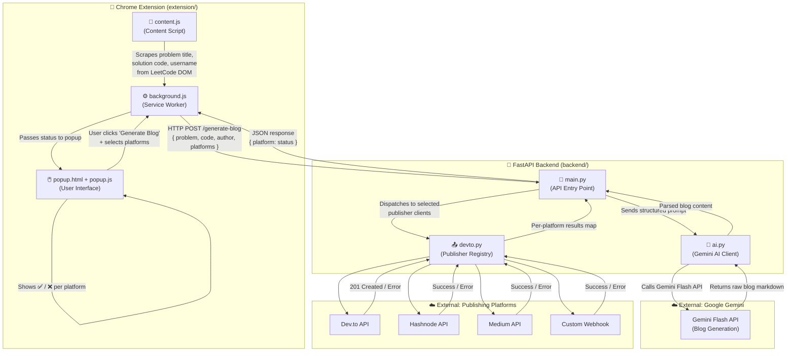

# 🏗️ LeetLog AI — Architecture

This document explains how LeetLog AI's components fit together. It is written for new contributors who want to understand the system before making changes.

---

## System Flow Diagram



---

## Layer-by-Layer Explanation

### 1. Chrome Extension (`extension/`)

The extension runs entirely inside the user's browser. It has three parts that communicate with each other via Chrome's messaging APIs.

| File | Role |
|---|---|
| `content.js` | Injected directly into the active LeetCode tab. Reads the DOM to extract the **problem title**, **solution code**, and **LeetCode username**. Sends this data to `background.js` via `chrome.runtime.sendMessage`. |
| `background.js` | The service worker — always running in the background. Receives the scraped data, appends the user's selected platforms, and makes the `POST /generate-blog` HTTP request to the FastAPI backend. Relays the response back to the popup. |
| `popup.html / popup.js` | The small UI that appears when the user clicks the extension icon. Lets the user select publishing platforms, triggers the flow by messaging `background.js`, and renders the per-platform success/failure status once the backend responds. |

**Key thing to know:** The extension cannot call the Gemini or publishing APIs directly — all secrets live in the backend `.env` file.

---

### 2. FastAPI Backend (`backend/`)

The backend is a lightweight Python server. Its only job is to receive a request from the extension, call Gemini, and fan out to the selected publishing platforms.

| File | Role |
|---|---|
| `main.py` | Defines the single endpoint `POST /generate-blog`. Validates the incoming request, calls `ai.py` to generate the blog, then calls `devto.py` to publish it. Returns a JSON map of `{ platform: "success" | "error" }` to the extension. |
| `ai.py` | Constructs the prompt sent to Gemini, calls the Gemini Flash API, and returns the generated blog markdown back to `main.py`. This is the only file that interacts with `GEMINI_API_KEY`. |
| `devto.py` | A publisher registry. Contains individual client classes for Dev.to, Hashnode, Medium, and custom webhooks. `main.py` passes only the platforms the user selected, so only those clients are invoked. Each client handles its own API auth and returns a success/failure status independently. |

---

### 3. External Services

| Service | Used By | Purpose |
|---|---|---|
| **Google Gemini Flash** | `ai.py` | Generates the structured blog post from the problem + solution |
| **Dev.to API** | `devto.py` | Publishes the blog post to the user's Dev.to profile |
| **Hashnode API** | `devto.py` | Publishes to the user's Hashnode publication |
| **Medium API** | `devto.py` | Publishes to the user's Medium account |
| **Custom Webhook** | `devto.py` | `POST`s the blog content to any user-defined URL |

---

## Request Lifecycle (Step by Step)

1. User is on a LeetCode problem page and has written their solution.
2. User opens the LeetLog AI popup, selects platforms (e.g. Dev.to + Hashnode), and clicks **"Generate Blog"**.
3. `popup.js` sends a message to `background.js`.
4. `background.js` asks `content.js` to scrape the current tab — getting the problem title, solution code, and username.
5. `background.js` sends `POST /generate-blog` to the FastAPI backend with the scraped data and selected platforms.
6. `main.py` receives the request and calls `ai.py`.
7. `ai.py` builds a structured prompt and calls the **Gemini Flash API**. The response is parsed into clean blog markdown.
8. `main.py` passes the blog content and selected platforms to `devto.py`.
9. `devto.py` calls each selected platform's API in parallel. Each call is independent — one failure does not block others.
10. `main.py` collects the per-platform results and returns them as a JSON object to `background.js`.
11. `background.js` forwards the results to `popup.js`, which renders a ✅ or ❌ for each platform.

---

## Key Files for New Contributors

If you're new to the codebase, start here depending on what you want to work on:

| Goal | Files to Read First |
|---|---|
| Add a new publishing platform | `backend/devto.py` — add a new client class following the existing pattern |
| Change the blog post structure or tone | `backend/ai.py` — edit the Gemini prompt |
| Modify what data is scraped from LeetCode | `extension/content.js` |
| Add a new UI option in the popup | `extension/popup.html` + `extension/popup.js` |
| Add a new API route or middleware | `backend/main.py` |
| Understand the data contract between extension and backend | The `POST /generate-blog` payload in `backend/main.py` |

---

## Environment Variables

All secrets are stored in `backend/.env` and are never committed to version control.

```
GEMINI_API_KEY            # Required — Google Gemini API key
DEVTO_API_KEY             # Required if publishing to Dev.to
HASHNODE_TOKEN            # Required if publishing to Hashnode
HASHNODE_PUBLICATION_ID   # Required if publishing to Hashnode
MEDIUM_TOKEN              # Required if publishing to Medium
MEDIUM_USER_ID            # Required if publishing to Medium
BLOG_WEBHOOK_URL          # Required if using a custom webhook
```

You only need the keys for the platforms you intend to use during development.

---

## Deployment Notes

- The backend is designed to be deployed on [Render](https://render.com/) as a free Web Service.
- After deploying, update the `API_URL` constant in `extension/background.js` to point to your public Render URL instead of `http://localhost:10000`.
- The extension always talks to a single backend URL — there is no client-side platform selection logic beyond choosing which platforms to pass in the request body.
